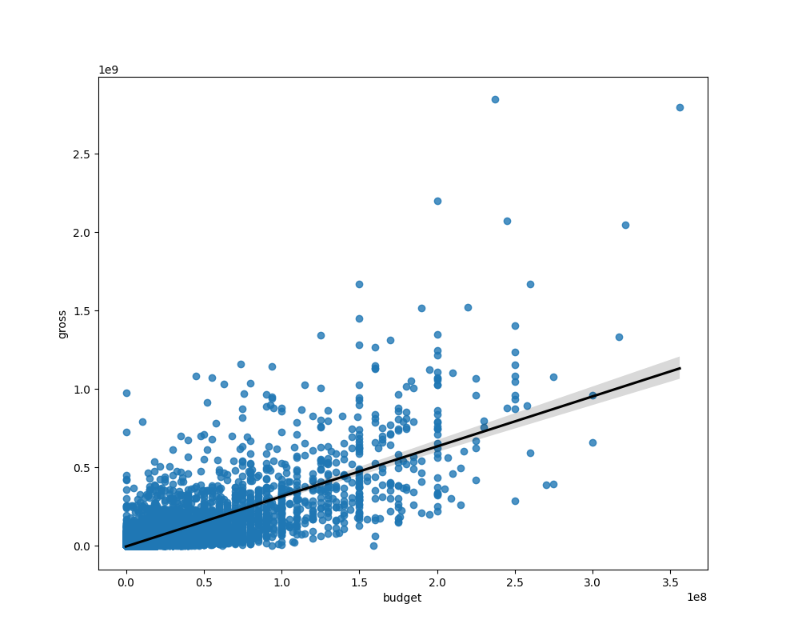
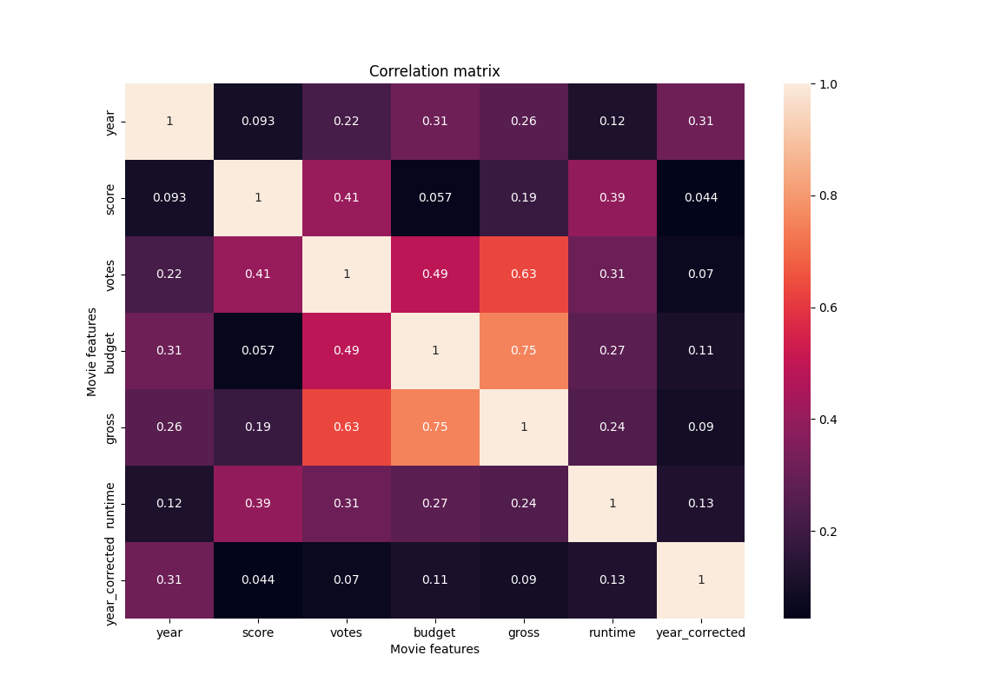
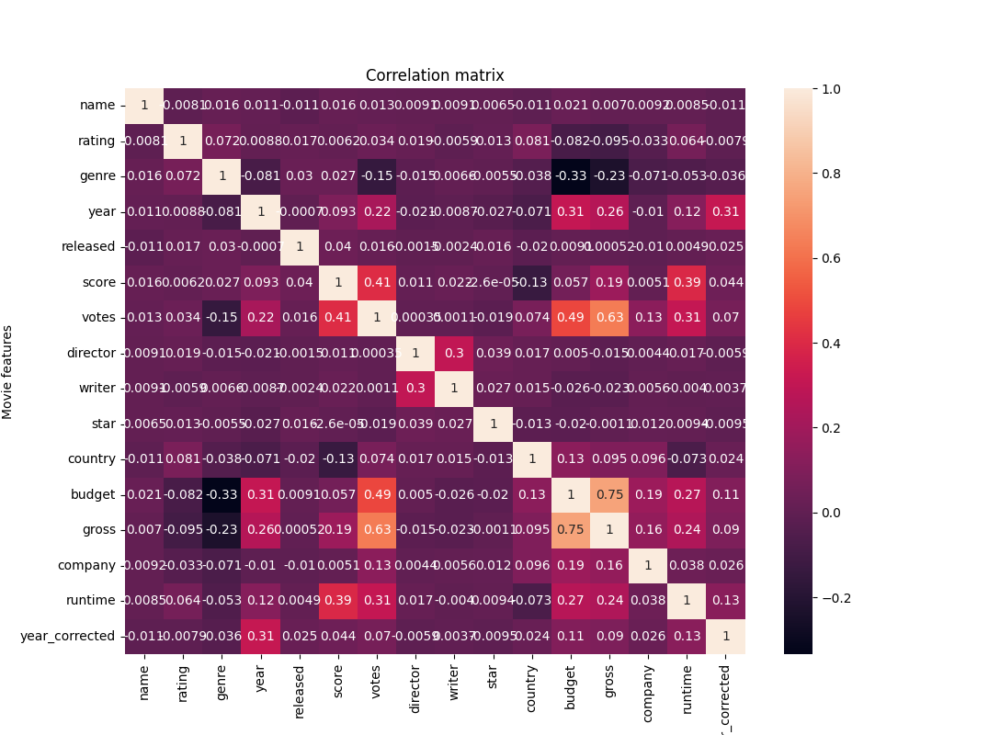

# Movies_dataset
Simple Python script for data manipulation, data cleaning, and data visualization

## Dataset: Link to access [data](https://www.kaggle.com/datasets/danielgrijalvas/movies).

### Packages to use:
```
import pandas as pd
import seaborn as sns
import matplotlib 
import matplotlib.pyplot as plt
from matplotlib.pyplot import figure
import numpy as np

matplotlib.rcParams['figure.figsize'] = (12,8)
```
### Load the data
```
data = pd.read_csv("movies.csv")
```

### Explore dataset
```
data.head
data.columns

```
### Search for missing data and replace NaN values with zeros
```
for col in data.columns:
    missing_val = np.mean(data[col].isnull())
    print('{} - {}%'.format(col, missing_val))

data = pd.DataFrame(data)
data.fillna(0, inplace = True)
print(data)
```
### Data cleaning

##### # 1) Data types
```
data.dtypes
```
#### 2) Change data types for budget and gross columns
```
data['budget'] = data['budget'].astype('int64')

data['gross'] = data['gross'].astype('int64')
```
#### 3) Select the year and create a new column for the correct year
```
def get_year(s):
    s = str(s)
    if s == '0':
        return -1

    l,_ = s.split('(')
    l = l.replace(',', '')
    l = l.split()  
    year = int(l[-1].strip())

    return year   

data['year_corrected'] = data['released'].apply(get_year)
```
#### 4) Order the data by gross 
```
data_sort = data.sort_values(by = ['gross'], inplace = False, ascending = False)
```

#### 5) Search and drop duplicate values
```
duplicates = data.drop_duplicates()
```

### Data Visualization

#### 1) Scaterr plot to see correlations between budget and gross revenue
```
x = data['budget']
y = data['gross']

plt.scatter(x,y)
plt.xlabel('Gross earnings')
plt.ylabel('Budget for film')
plt.title('Budget vs Gross earnings')
plt.show()
```


#### 2) Plot the correlation and the reg line using Seaborn
```
sns.regplot(x = 'budget', y = 'gross', data = data, line_kws = {'color':'black'})
plt.show()
```


#### 3) Calculate correlation matrix and plot a heatmap
```
corr_matrix = data.corr()

sns.heatmap(corr_matrix, annot=True)
plt.xlabel('Movie features')
plt.ylabel('Movie features')
plt.title('Correlation matrix')
plt.show()
```


#### 4) Change the object type to category and plot a heatmap with all values
```
data_numarized = data

for col_name in data_numarized.columns:
    if(data_numarized[col_name].dtype == 'object'):
        data_numarized[col_name] = data_numarized[col_name].astype('category')
        data_numarized[col_name] = data_numarized[col_name].cat.codes

data_numarized  

corr_matrix = data_numarized.corr()
corr_matrix_pairs = corr_matrix.unstack()
sort_pairs = corr_matrix_pairs.sort_values()


sns.heatmap(corr_matrix, annot=True)
plt.xlabel('Movie features')
plt.ylabel('Movie features')
plt.title('Correlation matrix')
plt.show()
```

