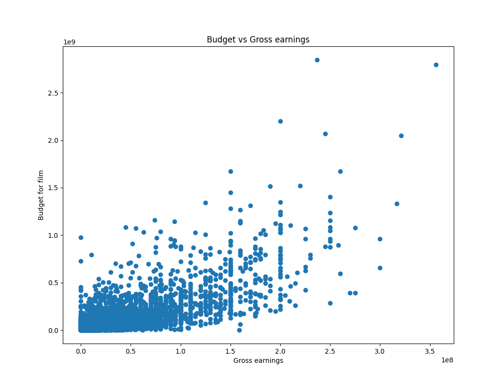

# Movies_dataset
Simple Python script for data manipulation, data cleaning, and data visualization

## Dataset: Link to access [data](https://www.kaggle.com/datasets/danielgrijalvas/movies).

### Packages to use:
```
import pandas as pd
import seaborn as sns
import matplotlib 
import matplotlib.pyplot as plt
from matplotlib.pyplot import figure
import numpy as np

matplotlib.rcParams['figure.figsize'] = (12,8)
```
### Load the data
```
data = pd.read_csv("movies.csv")
```

### Explore dataset
```
data.head
data.columns

```
### Search for missing data and replace NaN values with zeros
```
for col in data.columns:
    missing_val = np.mean(data[col].isnull())
    print('{} - {}%'.format(col, missing_val))

data = pd.DataFrame(data)
data.fillna(0, inplace = True)
print(data)
```
### Data cleaning

##### # 1) Data types
```
data.dtypes
```
#### 2) Change data types for budget and gross columns
```
data['budget'] = data['budget'].astype('int64')

data['gross'] = data['gross'].astype('int64')
```
#### 3) Create a new column for the correct year
```
def get_year(s):
    s = str(s)
    if s == '0':
        return -1

    l,_ = s.split('(')
    l = l.replace(',', '')
    l = l.split()  
    year = int(l[-1].strip())

    return year   

data['year_corrected'] = data['released'].apply(get_year)
```
#### 4) Order the data by gross 
```
data_sort = data.sort_values(by = ['gross'], inplace = False, ascending = False)
```

#### 5) Search and drop duplicate values
```
duplicates = data.drop_duplicates()
```

### Data Visualization

# 1) Scaterr plot to see correlations between budget and gross revenue


